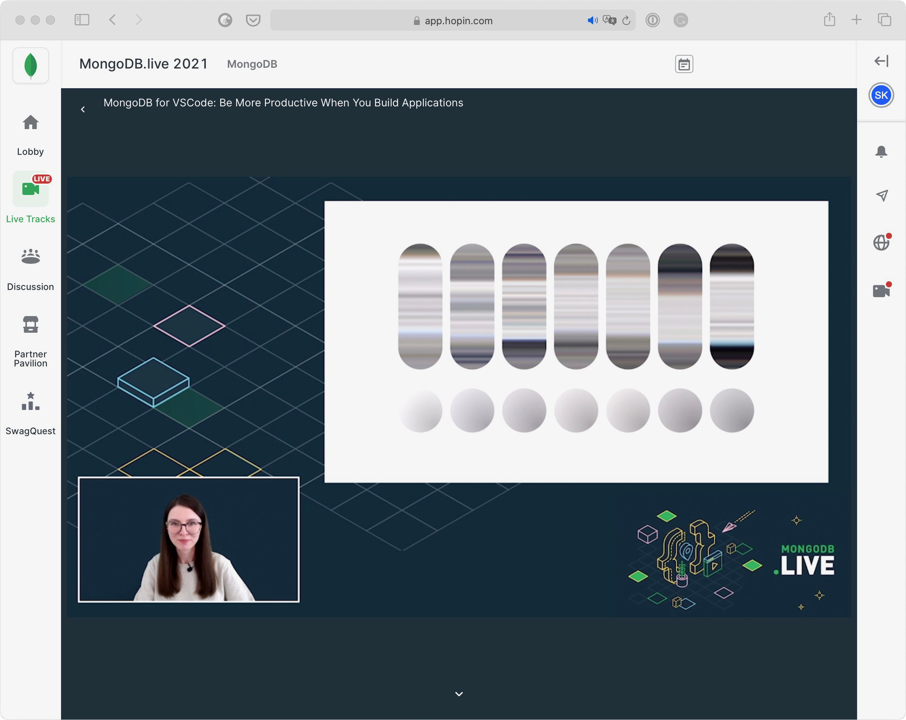

# MongoDB for VSCode: Be More Productive When You Build Applications

[MongoDB.live](https://mongodb.live) conference, 13.07.2021

Developers prototyping with data often lack the tools to help them remember exact query syntax and to debug intermediate query results. A workspace with context-aware code completion and embedded utilities would greatly augment their development experience and productivity and remove the need to switch between applications.

The MongoDB extension for VSCode allows developers to work with data alongside their applications’ code. Code reusability, handy snippets, syntax highlighting, and configurable extension settings allow developers to build applications with MongoDB quicker and easier.

In this talk, we will explore the main extension features, dive deep into JavaScript environments, called MongoDB playgrounds, and look at how they work under the hood. Whether you are interested in technical details or just want to improve your development processes and toolchains, this talk is for you.

Check out the talk [recording](https://www.youtube.com/watch?v=gvcOYitD8Pw), explore just [slides](./mdblive-slides.pdf), or lear more about the language server with child threads from my [blogpost](https://medium.com/dailyjs/the-language-server-with-child-threads-38ae915f4910).

[Download](https://marketplace.visualstudio.com/items?itemName=mongodb.mongodb-vscode) the extension.

The MongoDB for VSCode [product page](https://www.mongodb.com/products/vs-code).

[Working with MongoDB](https://code.visualstudio.com/docs/azure/mongodb) tutorial from VSCode documentation.

